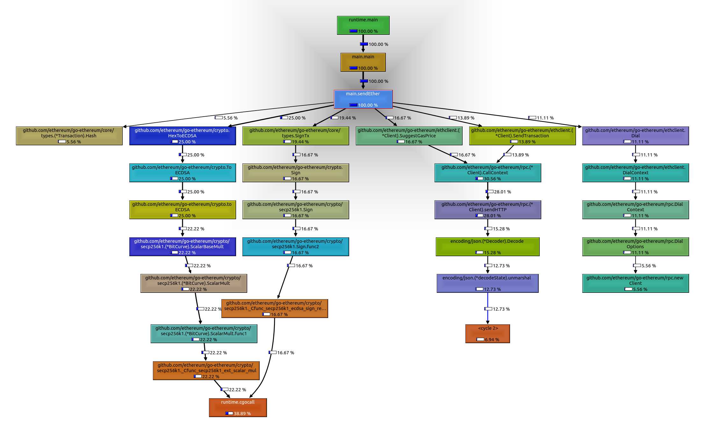
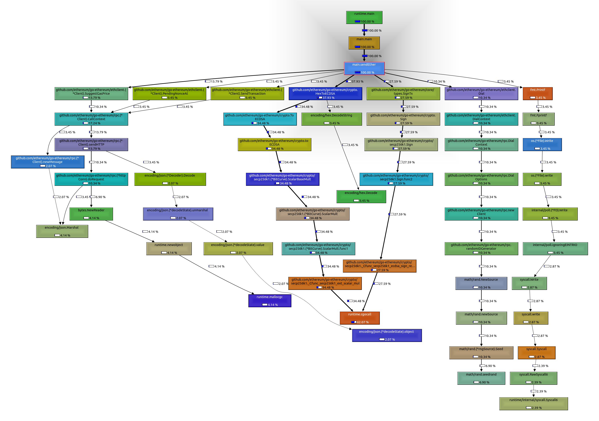

# Send transactions using the ethereum go client

This is a simple example of how to send transactions using the ethereum go client. The program sends N transactions (default to 1000) to the ethereum network.

## Start a test network

```bash
docker-compose up
```
Find the private key of the account in the logs and copy it to the `main.go` file.
```go
    // Set the sender's private key
	privateKey, err := crypto.HexToECDSA("private key here") // no 0x prefix
	if err != nil {
		log.Fatal(err)
	}
```

## Usage

```bash
make
```

Result:

```bash
 make
go build -o send-transaction
./send-transaction
#0 Transaction hash: 0xfc1d150e0941844b4ee3166a34e9f24e5c86d82188141e2cc2aaca390cb8fc35
#1 Transaction hash: 0x5ec0d3e636d1424f869dfc4d6937675371d935a29a4566db0b367710cf3d9e7a
#2 Transaction hash: 0xac1d0a29c85624a849416bce35aa2343d0a8a4f4faaac44c8f8f527773bbee78
#3 Transaction hash: 0x0a709d4d964d533b0f01da38194b9f29d1d1c799869f54fdfbebf4d0e0c13956
#4 Transaction hash: 0x072475aa64ab571d7d3a77a67a2c62ada231e0f496a84ab36c0611083d5fbbbd
#5 Transaction hash: 0x07cefddc17f82987e2a6dccd3cfeb458320e60d72d3d9d1b3d4ee4637499d4cc
#6 Transaction hash: 0x40bd64b4f64cf98dfaf448edbf024a55abf08437f86686d47f6590a456b64a72
#7 Transaction hash: 0xbb62d6bfc4c1147aa7ea153f2ee0dcc9510b3ef57fbd0e1e5a8ac88aea83e774
...
```

## Profiling

CPU profiling and heap profiling are available after you run `make` (in files cpu.prof and heap.prof).

To checkout the result:
```bash
go tool pprof cpu.prof
# Then in the pprof console:
# (pprof) web
#or
# (pprof) kcachegrind
```

If you get this error:
```bash
kcachegrind: symbol lookup error: /snap/core20/current/lib/x86_64-linux-gnu/libpthread.so.0: undefined symbol: __libc_pthread_init, version GLIBC_PRIVATE
```
Then you have to:
```bash
unset GTK_PATH
```


Image of the profiling result, using a live network (takes much longer due to network latency):



Using ganache-cli, the result is (faster because node is running locally):
